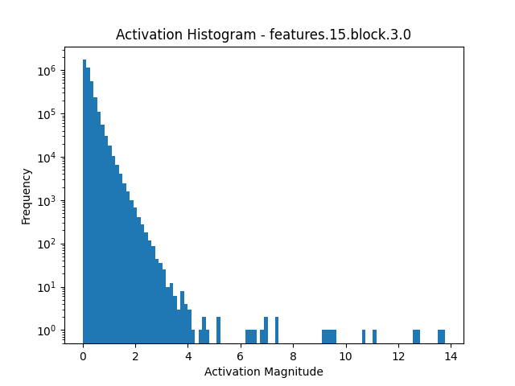
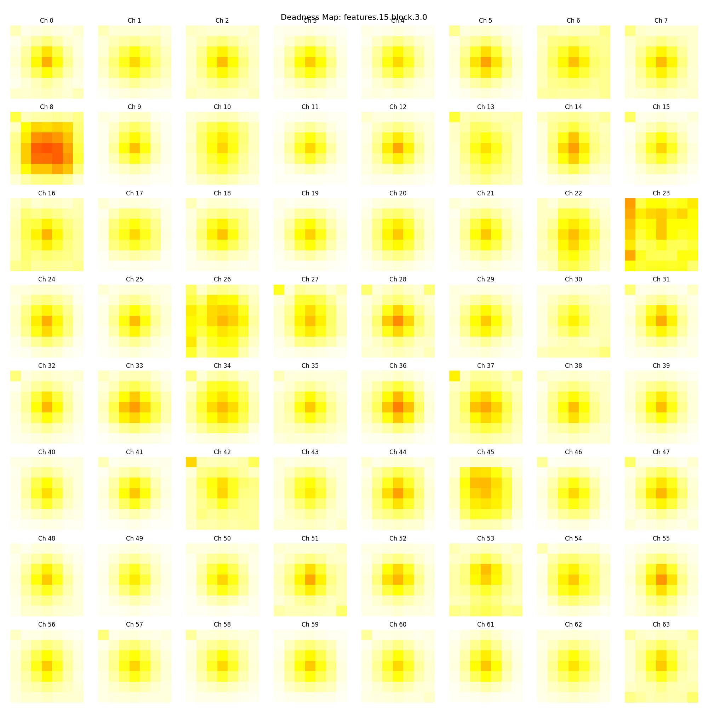
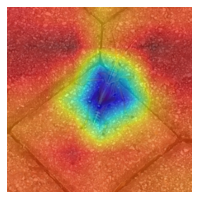

# Activation-Based Block Pruning Experiment
This section details the scripts specifically used for the activation-based block pruning experiment:

- `experiment_activation_based_block_pruning.py`: The core script for executing the activation-based pruning. It loads pre-calculated deadness scores and applies block-wise pruning to the MobileNetV3 model using `torch_pruning`.
- `get_model_architecture.py`: Used to extract and structure the layer names within MobileNetV3 blocks, generating a JSON file (mobilenetv3_block_structure.json) essential for block-wise pruning.
- `mobilenetv3_features.py`: Defines and saves the MobileNetV3 block structure mapping (e.g., expand, depthwise layers to their module names) to `mobilenetv3_block_structure.json`.
- `visualize_neuron_activations.py`: Analyzes and visualizes the distribution of neuron activation magnitudes across the network, aiding in determining thresholds for "deadness" detection.
- `visualize_channel_activation.py`: Calculates, visualizes, and saves per-channel "deadness" scores (how often activations fall below a threshold) into a JSON file (e.g., `pruning_plan_XX.json`), which serves as the pruning guide.
- `validate_model_structure.py`: Verifies the structural integrity of the pruned model by performing a forward pass and checking for runtime errors.
- `visualize_activation_overlay_image.py`: Visualizes activation heatmaps overlaid on input images, useful for understanding the model's focus, both before and after pruning.

# Findings and Challenges
- **Capturing Activation Magnitudes**: It is indeed possible to capture the activation magnitude of each individual neuron. Since these are real feature map values calculated from layer weights, the memory footprint can be massive, especially when processing a full dataset.
- **Mitigating RAM Usage**: To address the substantial RAM usage, stratified sampling can be employed to obtain a smaller, representative subset of the dataset that still encompasses all species.
- **Neuron Activation Threshold Sensitivity**: The choice of neuron activation threshold is critical for determining channel "deadness". Setting this threshold too high risks incorrectly identifying active channels as dead, leading to excessive pruning.
- **Structural Integrity and Dependencies**: A significant challenge in pruning is maintaining the model's structural integrity. Pruning one layer often necessitates corresponding pruning in subsequent, dependent layers. This layer-by-layer approach introduces complex inter-dependencies.
- **Dynamic Deadness**: Pruning an earlier layer can alter the activation patterns of downstream layers, meaning channels previously identified as "dead" might become active, or vice-versa, or even cease to exist.
- **Proposed Next Step**: Global Pruning Strategy: To address these complexities, a global pruning strategy is proposed. This involves:
  1. Generating an initial pruning strategy based on the first layer's activations.
  2. Overlaying the activation values onto this strategy.
  3. Applying pruning only where a match (consistent "deadness") occurs, otherwise leaving the channels unpruned.

Neuron activation value

Channel deadness visualization (the brighter the image, the more dead the channel)

Activation overlaid on image (`features_15_block_3_0`)
